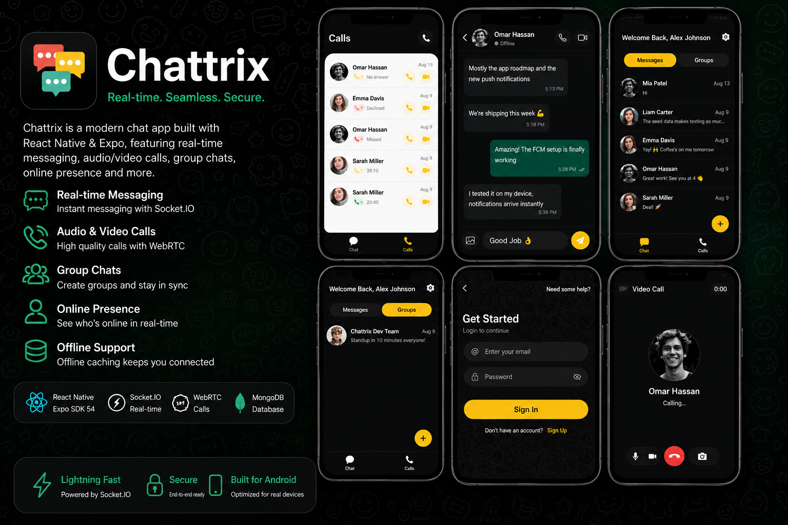

# Chattrix - React Native Chat Application



A modern, feature-rich React Native chat application built with Expo, featuring real-time messaging, audio/video calling, group chats, online status, and offline caching with a WhatsApp-inspired dark UI.

## 📱 Overview

**Chattrix** is a complete chat experience for Android physical devices (iOS support included). It combines modern web technologies with native-like performance, leveraging:

- **Expo SDK 54** with file-based routing via `expo-router`
- **Socket.IO** for real-time messaging and signaling
- **WebRTC** (via `react-native-webrtc`) for peer-to-peer audio/video calls
- **Firebase** for push notifications and FCM
- **MongoDB** with Mongoose for data persistence
- **Custom dark theme** inspired by WhatsApp's bubble styling

## 🚀 Features

### Core Messaging

- **Real-time chat** with Socket.IO (instant message delivery, typing indicators, read receipts)
- **Direct conversations** and **group chats**
- **Message types**: text, images, files
- **Message status**: sending (⏳), sent (✓), failed (![circle])
- **Group administration** with admin fields

### User Authentication

- **JWT-based login/register**
- Token storage in `AsyncStorage`
- Protected routes via Express middleware and Socket.IO auth
- Onboarding flow: welcome → login/register

### Real-time Presence

- **Online/offline status** with green/gray dots in conversation list
- AppState-aware: disconnects socket on background, reconnects on foreground
- Per-user room management for accurate presence

### Audio/Video Calls

- **WebRTC-based** audio/video calling (development build required)
- **Signaling** via Socket.IO (SDP offers/answers, ICE candidates)
- **Call flow**: initiate → ring → accept → ongoing → end
- **Maximum 4 participants** per call
- **60-second timeout** auto-ends unanswered calls
- **Controls**: mute/switch camera/hang up, in-call timer

### Search & Discovery

- **User search** by name/email via regex
- Accessible from Home FAB → user list modal
- Excludes current user from results

### Offline Support

- **AsyncStorage cache** for conversations, messages, and call history
- **Background refresh**: `refreshAll()` fetches latest data after initial cache load
- Graceful degradation when offline; resumes when connection restores

### UI/UX Highlights

- **WhatsApp dark bubble styling**: `myBubble: #005C4B`, `otherBubble: #202C33`, white text
- **Haptic tab bar** with dark background (`#neutral900`), primary accent (`#facc15`)
- **Toast notifications** with animated slide-up, auto-dismiss, color-coded icons
- **Circular avatars** with fallback `3d_profile.png`
- **Loading states**, empty states, and relative time formatting
- **Splash screen**: 2-second minimum hold, auth check, seamless native-to-JS transition

### Platform Considerations

- **Physical Android phone required** for push notifications and WebRTC
- **Development build** (`npx eas build`) needed for calls and push notifications
- **No emulator support** for full feature set
- **LAN IP auto-detection**: backend URL derived from Metro `hostUri`

## 🛠️ Installation

### Prerequisites

| Requirement | Details |
|-------------|---------|
| **Node.js** | v20+ (compatible with package engine) |
| **MongoDB** | Local (`mongodb://127.0.0.1:27017/chattrix`) or remote URI |
| **Firebase** | Service account key at `BACKEND/serviceAccountKey.json` |
| **Expo CLI** | `npm install -g expo-cli` or use via `npx expo` |
| **Physical Android Device** | Required for push notifications & WebRTC |
| **Development Build** | Required for WebRTC calling & push notifications |

### Client (Frontend) Setup

```bash
# From project root
npm install        # or: yarn install

# Start development server
npx expo start     # or: npx expo start -c (clear cache)
```

### Backend Setup

```bash
cd BACKEND
npm install        # installs: express, mongoose, socket.io, bcryptjs, firebase-admin, jsonwebtoken, cors, dotenv
```

Create `BACKEND/.env`:

```env
PORT=5002
MONGO_URI=mongodb://127.0.0.1:27017/chattrix
FIREBASE_SERVICE_ACCOUNT_PATH=../serviceAccountKey.json
```

### Running the App

```bash
# From project root - starts Expo dev server
npm start            # or: npx expo start

# Android (physical phone, development build for full features)
npx expo start --dev-client   # then scan QR with Expo Go
# or: npm run android

# iOS
npm run ios          #: expo run:ios

# Web (limited features)
npm run web          #: expo start --web
```

### Development Build (Required for Calls & Push)

```bash
npx eas build --profile development --platform android

# After build completes:
expo start --dev-client
```

### LAN Usage

Find your machine's local IP (`ipconfig` on Windows). The backend becomes accessible at `http://<YOUR_LAN_IP>:5002`. Ensure firewall allows inbound connections on port 5002. Other devices on the same Wi-Fi can connect using this URL.

## 🏗️ Architecture

### Folder Structure

```
app/                        # Expo router file-based navigation
  ├── _layout.tsx           # Root layout with all context providers
  ├── (auth)/               # Authentication flows (welcome, login, register)
  ├── (tabs)/               # Authenticated tab navigator (Chat + Calls)
  │   ├── _layout.tsx       # Auth guard (redirects if not authenticated)
  │   ├── index.tsx         # HomeScreen: conversations, online users, FAB
  │   └── audio.tsx         # Calls history screen
  ├── (call)/               # Call presentation stacks
  │   ├── _layout.tsx       # fullScreenModal, gestureEnabled:false
  │   ├── call_screen.tsx   # Active call UI: local/remote video, controls
  │   └── incoming_call_screen.tsx # Incoming call modal
  ├── chat_screen.tsx       # Direct chat (deep-linkable)
  └── splash_screen.tsx     # Initial splash (2s min, auth check)

context/                    # Five React context providers
  ├── auth_context.tsx      # AuthProvider: token, user, signIn/signUp/signOut
  ├── socket_context.tsx    # SocketProvider: connect/disjoin, joinRoom, onlineUsers
  ├── app_data_context.tsx  # AppDataProvider: conversations, messagesMap, refreshAll
  ├── call_context.tsx      # CallProvider: WebRTC state, peer connections
  └── notification_context.tsx # NotificationProvider: FCM token, push listeners

services/                   # API & socket services
  ├── auth_services.ts      # login(), register() axios calls
  ├── conversation_service.ts # getConversations, createDirect/Group, getMessages, sendMessage
  ├── call_service.ts       # initiateCallAPI, getCallHistory, getCallDetails
  ├── socket_service.ts     # SocketService class (io(), reconnect, rooms, events)
  ├── webrtc_service.ts     # WebRTCService: peer connections, ICE candidates
  ├── offline_cache.ts      # AsyncStorage cache (conversations, messages, calls)
  ├── notification_service.ts # registerFCM, save token, sendNotification
  └── profile_service.ts    # updateProfileImage, updateProfileName

constants/                  # Configuration and types
  ├── theme.ts              # Color palette (primary #facc15, myBubble #005C4B, otherBubble #202C33)
  ├── urls.ts               # Dynamic BASE_URL from Metro hostUri; fallbacks 10.0.2.2 / 127.0.0.1
  ├── types.ts              # UserProps, ConversationProps, MessageProps, CallProps
  └── webrtc_config.ts      # RTCConfiguration, STUN servers, MEDIA_CONSTRAINTS

BACKEND/                    # Node.js/Express server
  ├── src/
  │   ├── config/db.ts      # MongoDB connection
  │   ├── controller/       # auth, conversation, call controllers
  │   ├── middleware/       # auth middleware (JWT verification)
  │   ├── routes/           # API routes + Socket.IO routes
  │   ├── model/            # Mongoose schemas (User, Conversation, Message, Call)
  │   ├── services/         # FCM service
  │   └── socket/           # Socket.IO server init, auth middleware, event handlers
  ├── package.json          # backend dependencies
  ├── index.ts              # Entry: express app + httpServer + Socket.IO
  └── .env                # PORT=5002, MONGO_URI, FIREBASE_SERVICE_ACCOUNT_PATH

package.json                # Root deps, scripts (start, android, ios, web, lint)
eas.json                   # EAS build config (projectId: 274cf31b-a2bd-423e-a0d9-a044be900863)
app.json                   # Expo config: name, slug, orientation, icon, plugins, schemes
google-services.json       # Firebase Android config
assets/                    # Images: bgPattern.png, icon.png, splash-icon.png, chat.png, welcome.png
hooks/                     # use-color-scheme.ts, use-theme-color.ts
scripts/                   # reset-project.js (moves code to app-example)
```

### Navigation Flow (Expo-router)

1. **App start** → `SplashScreen` (minimum 2s) → checks `isAuthenticated`
2. **Not authenticated** → `(auth)/welcome_screen` → `login_screen` / `register_screen`
3. **Authenticated** → mounts `(tabs)` navigator (bottom tabs: Chat, Calls)
4. **HomeScreen** (`(tabs)/index.tsx`) shows: conversation list, online indicators, floating action button
5. **Chat navigation**: selecting a conversation pushes to `chat_screen` (deep-linkable as `/chat_screen`)
6. **Call navigation**:
   - Home FAB → `(call)/call_screen` with params `callId`, `callType` ("audio"|"video")
   - Incoming calls → `(call)/incoming_call_screen` (transparent modal, vibration)
   - Call layout: `headerShown: false`, `presentation: fullScreenModal`, `gestureEnabled: false`

### Context Providers Order (in `_layout.tsx`)

```tsx
<AuthProvider>                # first - needed for auth state
  <AppDataProvider>           # needs token from auth
    <NotificationProvider>    # needs token + isAuthenticated
      <SocketProvider>        # needs token
        <CallProvider>        # needs token + user
          <ThemeProvider>     # dark/light mode
            <RootGate/>       # splash gate, then navigation stack
```

### Socket.IO Event Flow

- **Client connects** with `auth: { token }` (see `socket_service.ts`)
- **Auth middleware** verifies JWT, attaches `socket.userId`, joins `user:{userId}` room
- **Chat events**: `chat:join` / `chat:leave` / `chat:message` / `chat:direct_message` / `chat:typing` / `chat:read`
- **Call events**: `call:join` / `call:leave` / `call:answer` / `call:declined` / `call:end` + WebRTC signals (`webrtc:offer`, `webrtc:answer`, `webrtc:ice_candidate`)
- **Online status**: `user:online` / `user:offline` broadcast on connect/disconnect + AppState foreground/background
- **Room-based**: conversations join `roomId`; messages emitted to `io.to(roomId)`; direct messages to `user:{recipientId}`

## 🌟 Features Details

### Authentication

- **JWT-based**: login/register via API, token stored in `AsyncStorage` under key `"token"`
- `loadTokens` on app startup checks expiry; expired tokens removed
- `signIn` → API login → saves token, navigates to `(tabs)`
- `signUp` → API register → navigates to login screen
- `signOut` → clears token, navigates to welcome screen
- Protected routes via `protectRoute` (Express) and `socketAuthMiddleware` (Socket.IO)

### Real-time Chat

- **Join conversation room** via `chat:join` room ID
- **Send messages** via `chat:message` event (content, type "text"|"image"|"file")
- **Broadcast** to all room participants; also emit `chat:new_message` to each participant's personal room for conversation list updates
- **Message status bubbles**: sending (⏳), sent (✓), failed (![circle])
- **Avatar images** circular with fallback `3d_profile.png`

### Online/Offline Status

- Socket tracks connected users in `Map<userId, Set<socketId>>`
- `AppState` listener: disconnect socket on app background, reconnect on foreground
- Online users list fetched on socket `connect`, updated via `user:online` / `user:offline` events
- Green dot indicator in conversation list when direct contact online

### Message Bubbles UI

- **WhatsApp dark bubble styling**: 
  - `myBubble: #005C4B` (dark green, sent by current user)
  - `otherBubble: #202C33` (dark gray, received)
- Supports text, images (with `attachment` URL), with time stamp footer
- Status icons within bubble: sending (⏳), sent (✓), failed (![circle])
- Avatar images circular with fallback `3d_profile.png`
- Group conversations show sender name above bubble

### Search

- `getUsers` service with `$regex` search on `name` or `email`
- Accessible via `+` FAB in HomeScreen → `(modal)/users_list_modal`
- Returns list of users excluding current user

### Groups

- Create group conversation via `createGroupConversation` (name, participantIds, optional avatar)
- Group conversations appear as `type: "group"` in conversation list
- Group admin stored in MongoDB `admin` field
- Group chat same UI as direct, with group name displayed

### Calls (Audio/Video)

- **Technology**: WebRTC via `react-native-webrtc` (requires development build)
- **Signaling**: Socket.IO with SDP offers/answers/ICE candidates
- **Call flow**:
  1. Initiate call → API `/calls/initiate` → creates Call doc status "ringing"
  2. Incoming call event to all participants via `call:incoming`
  3. User accepts → `call:answer` → WebRTC setup (`createOffer`, `setRemoteDescription`)
  4. Connected → status → "ongoing", start duration timer
  5. Toggle audio/video via `call:toggle_audio` / `call:toggle_video` events
  6. End call → `call:end` → API status update, duration calculation
- **Call screen UI**: 
  - Video grid (up to 4 participants) or audio call with caller name
  - Timer, mute/speaker switch, camera switch
  - Controls at bottom: hang up, mute, video on/off, switch camera
- **Timeout**: 60 seconds (`CALL_TIMEOUT_MS = 60000`) auto-end if no answer
- **Maximum participants**: 4 (including initiator)

### Offline Cache

- **AsyncStorage** cache for:
  - `conversations:direct` / `conversations:group`
  - `messages:{conversationId}`
  - `calls`
- On app start: serve cached data instantly, then background `refreshAll()` from API
- `upsertConversation` persists new conversations to cache
- `seedMessages` stores messages in `messagesMap` state

### Splash Screen

- Dark background `#1c1917` (matches `neutral900`)
- Logo animation (`FadeInDown`)
- Minimum display: 2000ms (`MIN_SPLASH_MS`)
- Checks auth state; redirects to `(tabs)` if authenticated, otherwise `(auth)` onboarding
- Prevents native splash gap via `SplashScreen.preventAutoHideAsync()`

### Additional UI/UX Details

- **Toast patterns**: colored icons (green checkmark, rose close, primary info/warning), animated slide-up/slide-down, auto-dismiss after 3s
- **Alert patterns**: `AppAlert` modal with animated scale/opacity, customizable buttons (default/cancel/destructive), icons (success/error/warning/info/question)
- **Theme**: Light mode (`neutral900` background, `neutral100` text) and Dark mode (`neutral900` background, `neutral100` text) via `ColorSchemeContext`
- **Profile image**: Cloudinary upload, circular avatar, socket `emitProfileUpdate` notifies other users

## 📦 Backend Setup

### Prerequisites

1. **MongoDB** running (local or remote URI)
2. **Firebase service account key** at `BACKEND/serviceAccountKey.json`
3. **Node.js** v20+

### Starting the Backend

```bash
cd BACKEND
npm install        # installs all dependencies
npm run dev        #: tsx watch index.ts  (runs with auto-reload)
# or: npm start
```

Server starts on `PORT` (default `5002` via `.env`) and logs:

```
Server running on port 5002
Socket.IO ready for connections
```

### API Endpoints (Summary)

| **Method** | **Endpoint** | **Description** |
|------------|--------------|-----------------|
| `POST /auth/register` | Register new user |
| `POST /auth/login` | Login, receive JWT token |
| `GET /` | Test: `{"success":true,"message":"API is running"}` |
| `PATCH /auth/profile-image` | Update profile image (protected) |
| `PATCH /auth/profile-name` | Update profile name (protected) |
| `POST /auth/fcm-token` | Save FCM token (protected) |
| `DELETE /auth/fcm-token` | Remove FCM token (protected) |
| `GET /conversations` | Get all conversations (`?type=direct` or `?type=group`) |
| `POST /conversations/direct` | Create direct conversation |
| `POST /conversations/group` | Create group conversation |
| `GET /conversations/:conversationId/messages` | Get messages with pagination |
| `POST /conversations/:conversationId/messages` | Send a message (triggers socket emit + FCM notification) |
| `GET /conversations/users` | Get all users (`?search=term` optional) |
| `POST /calls/initiate` | Start audio/video call |
| `GET /calls/history` | Get call history with pagination |
| `GET /calls/:callId` | Get specific call details |
| `PATCH /calls/:callId/status` | Update call status (ongoing/ended/missed etc.) |
| `PATCH /calls/:callId/participant` | Update participant status |

### Socket.IO Server Configuration

```js
const io = new Server(httpServer, {
  cors: { origin: "*", methods: ["GET", "POST"], credentials: true },
  pingTimeout: 20000,
  pingInterval: 15000,
});
```

- **Auth middleware**: verifies JWT from handshake `auth.token`, `Authorization: Bearer`, or query `?token=`
- **On connection**: user joins `user:{userId}` room, broadcasts `user:online`
- **Room management**: `chat:join` / `chat:leave`; calls join `call:{callId}`
- **Event handlers**: chat, typing, read receipts, online users, WebRTC signals
- **Disconnect**: removes socket from user's set, broadcasts `user:offline` if last socket

### Firebase Admin SDK

- Initialized once on server start via `initializeFirebase()`
- Uses `serviceAccountKey.json` from BACKEND root
- `sendNotification()`: multicast to tokens with Android/iOS/APNS configs
- `sendMessageNotification()`: builds notification content based on message type
- `sendCallNotification()`: incoming call notification with caller name, call type

### Database Models (Summary)

| **Collection** | **Key Fields** |
|----------------|----------------|
| **users** | `email` (unique, lowercase), `password` (hashed), `name`, `img`, `fcmTokens` [{token, platform, createdAt}] |
| **conversations** | `type` ("direct"|"group"), `name` (group only), `avatar`, `participants` [ObjectId], `admin` (group), `lastMessage`, timestamps |
| **messages** | `conversation` ref, `sender` ref, `content`, `type` ("text"|"image"|"file"), `attachment`, `readBy` [ObjectId], timestamps |
| **calls** | `type` ("audio"|"video"), `status` (initiated/ringing/ongoing/ended/missed/declined/failed), `initiator`, `participants` [{user, status, joinedAt, leftAt}], `isGroupCall`, `startedAt`, `endedAt`, `duration`, metadata |

## ⚠️ Known Constraints

| **Constraint** | **Detail** |
|----------------|------------|
| **Physical Android Phone Required** | Push notifications do not work on emulator; `Device.isDevice` check in `notification_service.ts`. Use a real phone with USB debugging. |
| **No Emulator for Full Features** | WebRTC calling requires a development build (eas) and a physical device; Expo Go limitations prevent WebRTC and push notifications. |
| **LAN IP Usage** | When running via `expo start` with dev client, the backend `BASE_URL` is auto-derived from Metro's `hostUri`. On a local network, other devices can access the backend using your machine's local IP. Ensure firewall allows inbound connections. |
| **Development Build Required** | Key features requiring development build: 1) WebRTC calls (`react-native-webrtc`), 2) Firebase push notifications (`expo-notifications` with `getDevicePushTokenAsync`). Without dev build, these features gracefully degrade (calls show warning, notifications return null). |
| **iOS Similar Constraints** | iOS simulator also cannot receive push notifications; physical device required. iOS may have different Metro host URI handling (`127.0.0.1`). |
| **Metro Host URI Detection** | `constants/urls.ts` auto-detects backend host: if Metro is running with a tunnel/ngrok-like host, that host is used; otherwise Android emulator uses `10.0.2.2` (localhost mapping), iOS simulator uses `127.0.0.1`. For LAN development, ensure Metro is started on the machine hosting the backend. |

## 🛠️ Build & Development Commands

### Root `package.json` Scripts

| **Script** | **Command** | **Description** |
|------------|-------------|-----------------|
| `start` | `expo start` | Starts Expo development server |
| `android` | `expo run:android` | Runs app on connected Android device/emulator |
| `ios` | `expo run:ios` | Runs app on iOS simulator/device |
| `web` | `expo start --web` | Starts web version (browser, limited features) |
| `lint` | `expo lint` | Runs ESLint on the project |
| `reset-project` | `node ./scripts/reset-project.js` | Moves starter code to `app-example`, creates blank `app` (use with caution) |

### Backend Scripts (`BACKEND/package.json`)

| **Script** | **Command** | **Description** |
|------------|-------------|-----------------|
| `dev` | `tsx watch index.ts` | Starts backend with tsx auto-reload (recommended for development) |
| `test` | `echo "Error: no test specified" && exit 1` | Placeholder |

### Common `expo start` Flags

```bash
npx expo start                                          # Standard start
npx expo start -c                                      # Clear cache before starting
npx expo start --dev-client                           # Start with development build
npx expo start -t android                             # Start Android only
npx expo start -t ios                                 # Start iOS only
# Using yarn
yarn start
# Using pnpm
pnpm start
```

### Development Build Workflow

```bash
# 1. Build development Android image
npx eas build --profile development --platform android

# 2. Wait for build to complete, then start
expo start --dev-client

# 3. Scan QR code with Expo Go app (or run directly on device)
# The app will now have full WebRTC and push notification capabilities.
```

## 🎨 Design Highlights

### WhatsApp Dark Bubble Styling

- **Primary palette**: 
  - `primary: #facc15` (yellow/amber accent)
  - `myBubble: #005C4B` (dark green, matches WhatsApp sent bubbles)
  - `otherBubble: #202C33` (dark gray, matches WhatsApp received bubbles)
- Message bubbles have `borderBottomRightRadius: 3` (sent) / `borderBottomLeftRadius: 3` (received) for subtle rounding
- Time stamp in footer with `rgba(255,255,255,0.65)` text color for contrast on dark bubbles
- Group messages show sender name in smaller text (`fontSize: 12`, `colors.neutral300`) above the bubble

### Error Toast Patterns

- **Singleton `ToastHost`** mounted once in `RootLayout`
- **Types and colors**:
  - `success`: green checkmark icon, green text
  - `error`: close-circle icon, rose (`#ef4444`) text
  - `info`: information-circle icon, `primaryDark` (`#b91c1c` effectively)
  - `warning`: warning icon, `primaryDark`
- **Animation**: Slide-up from top (`Animated.spring` to `translateY: 0`), fade-in opacity, 250ms duration, native driver when possible
- **Dismiss**: Auto-hide after `duration` (default 3000ms), or user tap on toast container
- **Imperative API**: `Toast.show({type, title, message})`, `Toast.success(msg, title)`, `Toast.error(msg, title)`, etc.

### Socket Reconnection Logic

- **SocketService** options (in `services/socket_service.ts`):
  ```js
  {
    reconnection: true,
    reconnectionAttempts: Infinity,
    reconnectionDelay: 1000,
    reconnectionDelayMax: 5000,
    timeout: 20000,
  }
  ```
- **AppState listener** (`context/socket_context.tsx`):
  - On app **foreground**: if token available and not connected, reconnect socket + reattach listeners
  - On app **background**: disconnect socket, set `isConnected: false`, clear online users
- Ensures users don't appear online while app is in background (battery + accuracy)
- **Cleanup** on component unmount: `offMessage()`, `offDirectMessage()`, `offNewMessage()`, `offTyping()`, plus `removeAllCallListeners()` for call contexts

### Other Design Choices

- **Circular avatars** with `borderRadius: 50%` / `borderRadius: 30` / `borderRadius: 70` depending on context
- **Floating Action Button** (FAB) on HomeScreen: `position: absolute`, `bottom: 20`, `right: 20`, elevation + shadow for depth
- **Tab bar customization**: full-width background `#neutral900`, height `65`, haptic feedback on select, active tint `#facc15`, inactive tint `white`
- **Loading states**: `ActivityIndicator` with `size="large"` + primary color, displayed during initial data fetch and refresh
- **Empty states**: illustrated with `Ionicons` (chatbubbles-outline, people-outline, call-outline) + text prompts
- **Message timestamps**: `toLocaleTimeString` with 2-digit hours/minutes; relative dates (today, yesterday, this week, else full date) in conversation list
- **Profile image upload**: Cloudinary preset `react_native`, cloud `dh9yyhavk`; automatic round cropping in UI; socket emit to update other users

## 📂 Repository Information

| **Detail** | **Value** |
|------------|-----------|
| **Git Remote URL** | `https://github.com/Aziz-589/Chattrix.git` |
| **Owner** | Aziz-589 |
| **Default Branch** | `main` |
| **Recent Commits** | `fb431ad` (splash gateway), `a6c40f8` (root layout gate), `851abd5` (babel config, urls auto-detect) |

### Git Commands for Contributors

```bash
# View remotes
git remote -v

# Check current branch
git branch

# List all branches (local & remote)
git branch -a

# Switch to main branch
git checkout main

# Create and switch to new branch
git checkout -b feature/new-feature

# Push new branch to remote
git push -u origin feature/new-feature

# Pull latest from main
git pull origin main

# View recent commits
git log --oneline -10
```

## 🔍 SEO Optimization

**Keywords**: React Native, Expo, Chat application, real-time messaging, Socket.IO, WebRTC, Firebase, MongoDB, Chattrix, mobile messaging, group chat, audio video calls

**Description**: Chattrix is a feature-rich React Native chat application built with Expo SDK 54, featuring real-time messaging with Socket.IO, audio/video calling with WebRTC, group chats, online/offline status, offline caching, and a WhatsApp-inspired dark UI. Perfect for developers looking to build modern cross-platform messaging apps.

**Headings Structure** (as used in this README) helps with searchability. Consider adding:
- Badges for Expo, Node.js, MongoDB versions
- Architecture diagram (PlantUML or Mermaid)
- Contribution guidelines
- License information (MIT)

## 📄 License

This project is licensed under the **MIT License** - see the `LICENSE` file for details.

---

*Built with ❤️ using Expo, React Native, Socket.IO, WebRTC, and MongoDB. For questions or contributions, please open an issue on the GitHub repository.*